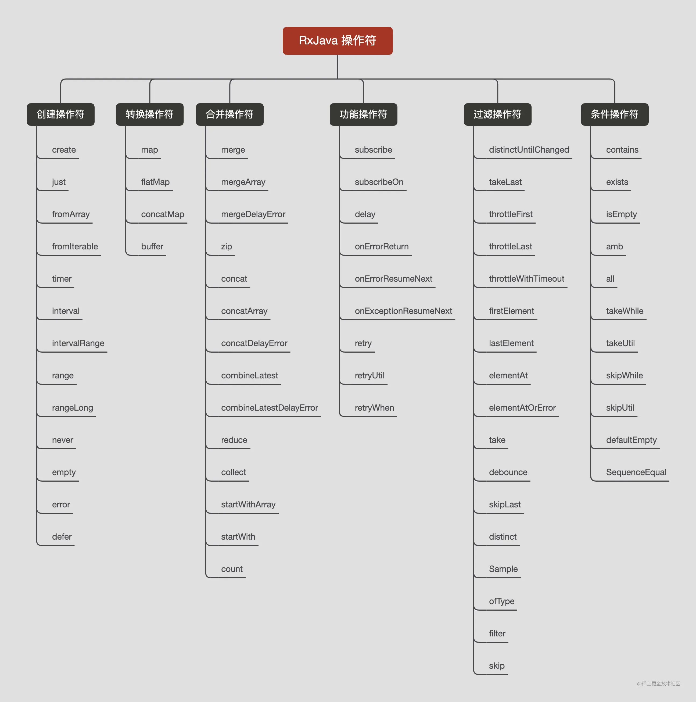

众所周知，RxJava 是一个非常流行的第三方开源库，它能将复杂的逻辑简单化，提高我们的开发效率，一个这么好用的库，来让我们学习一下吧🍺

下面我抛出一些问题，如果你都知道，那么恭喜你，你对 RxJava 掌握的很透彻，如果你对下面这些问题有一些疑惑，那么你就可以接着往下看，
我会由浅入深的给你讲解 RxJava，看完之后，这些问题你会非常明了
1、什么是观察者模式？什么是装饰者模式？
2、观察者模式，装饰者模式在 RxJava 中的应用？
3、RxJava map 和 flatMap 操作符有啥区别？
4、如果有多个 subscribeOn ，会是一种什么情况？为啥？
5、如果有多个 observeOn ，会是一种什么情况？为啥？
6、RxJava 框架流思想设计？
7、RxJava 的 Subject 是什么？
8、如何通过 RxJava 实现一个自己的事件总线？

一、设计模式介绍
我们先了解一下下面两种设计模式：

1、观察者模式

1.rxjava设计模式

    rxjava准确来说不是标准的观察模式,在标准的观察者模式中是一个被观察者对应多个观察者,而在rxjava是多个被观察者对应一个观察者
为什么是个被观察者对应一个观察者? 因为我们Observable.create是一个被观察者,map操作符也是被观察者,最后我们只有一个终点,所以是多个被观察者对应一个观察者

2、装饰者模式
简单的理解：对象间存在一种一对多的依赖关系，当一个对象的状态发生改变时，所有依赖于它的对象都会得到通知并被自动更新

1.1.2、观察者模式示例

//1、定义一个观察者的接口   client ->
interface Observer {
    /**
     * 接收事件的方法
     */
    fun onChange(o: Any)
}

//2、定义一个被观察者的接口   <-- server
interface Observable {
    /**
     * 添加观察者
     */
    fun addObserver(observer: Observer)
    /**
     * 移除观察者
     */
    fun removeObserver(observer: Observer)
    /**
     * 发送事件通知
     */
    fun changeEvent(o: Any)
}

//3、定义一个观察者的实现类
class ObserverImpl: Observer {
    override fun onChange(o: Any) {
      	//对事件进行打印
        println(o)
    }
}

//4、定义一个被观察者的实现类
class ObservableImpl: Observable {

    //存放观察者的集合
    private val observerList: MutableList<Observer> = LinkedList()

    override fun addObserver(observer: Observer) {
        observerList.add(observer)
    }

    override fun removeObserver(obs事件，而 RxJava 里面定义了专门发送事件的接口erver: Observer) {
        observerList.remove(observer)
    }

    override fun changeEvent(o: Any) {
        for (observer in observerList) {
            observer.onChange(o)
        }
    }
}

//5、测试
fun main(){
    //1、创建被观察者
    val observable = ObservableImpl()
    //2、创建观察者
    val observer1 = ObserverImpl()
    val observer2 = ObserverImpl()
    val observer3 = ObserverImpl()
    //3、添加观察者
    observable.addObserver(observer1)
    observable.addObserver(observer2)
    observable.addObserver(observer3)
    //4、发送事件
    observable.changeEvent("erdai666")
}
//打印结果
erdai666
erdai666
erdai666

1.2、装饰者模式

1.2.1、装饰者模式定义
简单的理解：动态的给一个类进行功能增强

1.2.2、装饰者模式示例
举个例子：我想吃个蛋炒饭，但是单独一个蛋炒饭我觉得不好吃，我想在上面加火腿，加牛肉。我们使用装饰者模式来实现它

//1、定义一个炒饭的接口
interface Rice {
    fun cook()
}

//2、定义一个炒饭接口的实现类：蛋炒饭
class EggFriedRice: Rice {

    override fun cook() {
        println("蛋炒饭")
    }
}

//3、定义一个炒饭的抽象装饰类
abstract class RiceDecorate(var rice: Rice): Rice

//4、往蛋炒饭中加火腿
class HamFriedRiceDecorate(rice: Rice): RiceDecorate(rice) {
    override fun cook() {
        rice.cook()
        println("加火腿")
    }
}

//5、往蛋炒饭中加牛肉
class BeefFriedRiceDecorate(rice: Rice): RiceDecorate(rice) {

    override fun cook() {
        rice.cook()
        println("加牛肉")
    }
}

//6、测试
fun main(){
    //蛋炒饭
    val rice = EggFriedRice()
    //加火腿
    val hamFriedRiceDecorate = HamFriedRiceDecorate(rice)
    //加牛肉
    val beefFriedRiceDecorate = BeefFriedRiceDecorate(hamFriedRiceDecorate)
    beefFriedRiceDecorate.cook()
}
//打印结果
蛋炒饭
加火腿
加牛肉
装饰者模式的核心：定义一个抽象的装饰类继承顶级接口，然后持有这个顶级接口的引用，接下来就可以进行无限套娃了😄

二、手撸 RxJava 核心源码实现

2.1、RxJava 介绍
RxJava 是一个异步操作框架，其核心可以归纳为两点：1、异步事件流 2、响应式编程。接下来我们可以好好的去感受这两点

2.2、RxJava 操作符
RxJava 之所以强大源于它各种强大的操作符，掌握好这些操作符能让你对 RxJava 的使用得心应手，RxJava 操作符主要分为 6 大类：

每一个操作符背后都对应了一个具体的实现类，接下来我们就挑几个最常用，最核心的操作符：
create，map，flatMap，observeOn，subscribeOn 进行手撸实现，相信看完这些操作符的实现后，你能融会贯通，举一反三

注意：下面这些操作符的实现和 RxJava 实现细节不尽相同，但核心思想是一致的，大家只要理解核心思想就好

2.3、create 操作符实现
create 是来创建一个被观察者对象，看了 RxJava create 操作符源码你会发现：
1、create 是使用观察者模式实现的，但 RxJava 里面使用的观察者模式和我们上面介绍的还有点不一样，它是一种变种的观察者模式
2、上面例子中我们是通过被观察者去发送事件，而 RxJava 里面定义了专门发送事件的接口，这样做的好处就是让被观察者和发射事件进行解耦

//1、定义一个观察者的顶级接口
interface Observer<T> {
        //建立了订阅关系
        fun onSubscribe()
        //接收到正常事件
        fun onNext(t: T)
        //接收到 error 事件
        fun onError(e: Throwable)
        //接收到 onComplete 事件
        fun onComplete()
}

//2、定义一个被观察者的顶级接口
interface ObservableSource<T> {
    //订阅观察者
    fun subscribe(observer: Observer<T>)
    }
}

//3、定义一个被观察者抽象类实现顶层被观察者接口
abstract class Observable<T>: ObservableSource<T> {

    override fun subscribe(observer: Observer<T>) {
        subscribeActual(observer)
    }

    //实际订阅观察者的抽象方法，让子类去实现
    protected abstract fun subscribeActual(observer: Observer<T>) 

    //伴生类里面的方法，直接通过类名调用    
    companion object{
      	//这里是我们实现 create 操作符对外提供和 RxJava 类似的方法调用
        fun <T> create(source: ObservableOnSubscribe<T>): ObservableCreate<T>{
            return ObservableCreate(source)
        }
    }
}

//4、定义一个与被观察者发射事件解耦的接口
interface ObservableOnSubscribe<T> {
    //通过 Emitter 发射事件
    fun subscribe(emitter: Emitter<T>)
}

//5、定义事件发射器接口
    interface Emitter<T> {
    //发送 onNext 事件
    fun onNext(t: T)
    //发送 onError 事件
    fun onError(e: Throwable)
    //发送 onComplete 事件
    fun onComplete()
}

//6、定义 create 操作符的实现类
class ObservableCreate<T>(var source: ObservableOnSubscribe<T>): Observable<T>() {

    //实现父类订阅观察者的方法
    override fun subscribeActual(downStream: Observer<T>) {
      	//可以看到只要一订阅，首先就会接收 onSubscribe 事件
        downStream.onSubscribe()
      	//通过 ObservableOnSubscribe 里面的 Emitter 进行事件的发送，完成被观察者发送事件的解耦
        source.subscribe(CreateEmitter(downStream))
    }

    //事件发射器实现类，可以看到传入了下游的观察者来接收我们发射的事件
    class CreateEmitter<T>(var downStream: Observer<T>): Emitter<T>{

        override fun onNext(t: T) {
            downStream.onNext(t)
        }

        override fun onError(e: Throwable) {
            downStream.onError(e)
        }

        override fun onComplete() {
            downStream.onComplete()
        }
    }
}

//7、测试
fun main(){
Observable.create(object : ObservableOnSubscribe<String>{
    override fun subscribe(emitter: Emitter<String>) {
    //发射 onNext 事件
    emitter.onNext("erdai666")
    //发射 onComplete 事件
    emitter.onComplete()
}
}).subscribe(object : Observer<String>{
override fun onSubscribe() {
println("onSubscribe")
}

        override fun onNext(t: String) {
            println("onNext：$t")
        }

        override fun onError(e: Throwable) {
        }

        override fun onComplete() {
            println("onComplete")
        }
    })
}
//打印结果
onSubscribe
onNext：erdai666
onComplete

2.4、map 操作符实现
map 是一个转换操作符，它能把一种类型转为为另外一种类型，如：Int -> String。

它的主要实现：观察者模式 + 装饰者模式 + 泛型

//1、定义一个抽象装饰类，注意里面泛型的使用
abstract class AbstractObservableWithUpstream<T,U>(var source: ObservableSource<T>): Observable<U>()

//2、定义一个类型转换的接口
interface Function<T,U> {
//传入 T 类型，返回 U 类型
fun apply(t: T): U
}

//3、定义 map 操作符的实现类
class ObservableMap<T,U>(source: ObservableSource<T>,var function: Function<T,U>): AbstractObservableWithUpstream<T,U>(source) {

    //实现父类订阅观察者的方法
    override fun subscribeActual(observer: Observer<U>) {
      	//接收 onSubscribe 事件
        observer.onSubscribe()
      	//完成事件的转换
        source.subscribe(MapObserver(function,observer))
    }

    //MapObserver 接收 function 对类型进行转换，downStream 对事件进行接收
    class MapObserver<T,U>(var function: Function<T,U>,var downStream: Observer<U>): Observer<T>{
        override fun onSubscribe() {
        }

        override fun onNext(t: T) {
            //核心：当接收到 T 类型，调用 function.apply 转换为 U 类型
            val u: U = function.apply(t)
            downStream.onNext(u)
        }

        override fun onError(e: Throwable) {
            downStream.onError(e)
        }

        override fun onComplete() {
            downStream.onComplete()
        }

    }
}

//4、Observable 中增加相应的调用方法
fun <U> map(function: Function<T, U>): ObservableMap<T,U>{
return ObservableMap(this, function)
}

//5、测试
fun main(){
Observable.create(object : ObservableOnSubscribe<String>{
override fun subscribe(emitter: Emitter<String>) {
emitter.onNext("erdai666")
emitter.onComplete()
}
})
.map(object : Function<String,String>{
override fun apply(t: String): String {
return "map 转换：$t"
}
})
.subscribe(object : Observer<String>{
override fun onSubscribe() {
println("onSubscribe")
}

        override fun onNext(t: String) {
            println("onNext：$t")
        }

        override fun onError(e: Throwable) {
        }

        override fun onComplete() {
            println("onComplete")
        }
    })
}

//打印结果
onSubscribe
onNext：map 转换：erdai666
onComplete

2.5、flatMap 操作符实现
flatMap 操作符的实现其实和 map 类似，只不过是把 ：Function<T, U> -> Function<T, ObservableSource> ，
将一种类型转换为了一个被观察者的类型，被观察者的类型又可以进行一系列的转换，因此能拆分更细的粒度：

//1、定义 flatMap 操作符的实现类
class ObservableFlatMap<T,U>(source: ObservableSource<T>,var function: Function<T,ObservableSource<U>>): AbstractObservableWithUpstream<T,U>(source) {

    override fun subscribeActual(observer: Observer<U>) {
        observer.onSubscribe()
        source.subscribe(FlatMapObserver(function,observer))
    }

    //FlatMapObserver 接收 function 对类型进行转换，downStream 对事件进行接收
    class FlatMapObserver<T,U>(var function: Function<T,ObservableSource<U>>, var downStream: Observer<U>): Observer<T>{
        override fun onSubscribe() {
        }

        override fun onNext(t: T) {
            //核心：当接收到 T 类型，调用 function.apply 转换为 ObservableSource<U> 类型
            val u: ObservableSource<U> = function.apply(t)
            //对 u 进行更细粒度的拆分，在让下游观察者进行接收
            u.subscribe(object : Observer<U>{
                override fun onSubscribe() {

                }

                override fun onNext(t: U) {
                    downStream.onNext(t)
                }

                override fun onError(e: Throwable) {

                }

                override fun onComplete() {

                }
            })
        }

        override fun onError(e: Throwable) {
            downStream.onError(e)
        }

        override fun onComplete() {
            downStream.onComplete()
        }
    }
}

//2、Observable 中增加相应的调用方法
fun <U> flatMap(function: Function<T,ObservableSource<U>>): ObservableFlatMap<T,U>{
return ObservableFlatMap(this,function)
}

//3、测试
fun main(){
Observable.create(object : ObservableOnSubscribe<String>{
override fun subscribe(emitter: Emitter<String>) {
emitter.onNext("erdai666")
emitter.onComplete()
}
}).flatMap(object : Function<String,ObservableSource<String>>{
override fun apply(t: String): ObservableSource<String> {
return Observable.create(object : ObservableOnSubscribe<String>{
override fun subscribe(emitter: Emitter<String>) {
emitter.onNext("flatMap：$t")
}
})
}

    })
        .subscribe(object : Observer<String>{
        override fun onSubscribe() {
            println("onSubscribe")
        }

        override fun onNext(t: String) {
            println("onNext：$t")
        }

        override fun onError(e: Throwable) {
        }

        override fun onComplete() {
            println("onComplete")
        }
    })
}

//打印结果
onSubscribe
onNext：flatMap：erdai666
onComplete

2.6、subscribeOn 操作符实现

subscribeOn 主要是用来决定我们订阅观察者是在哪个线程执行

//1、定义一个抽象的调度器
abstract class Scheduler {

    abstract fun createWorker(): Worker
    
    //定义一个抽象的 Worker
    abstract class Worker{
      	//真正决定线程执行
        abstract fun schedule(runnable: Runnable)
    }
}

//2、定义调度器的实现类，我们主要实现两种：
//2.1、AndroidMainScheduler：Android 主线程
//可以看到我们就是使用 Handler 将线程切换到主线程
class AndroidMainScheduler(var handler: Handler): Scheduler() {
override fun createWorker(): Worker {
return AndroidMainWorker(handler)
}

    class AndroidMainWorker(var handler: Handler): Worker(){
        override fun schedule(runnable: Runnable) {
            handler.post(runnable)
        }
    }
}

//2.2、NewThreadScheduler：开启一个新的子线程
//可以看到我们就是使用线程池来执行 runnable
class NewThreadScheduler(var executorService: ExecutorService): Scheduler() {

    override fun createWorker(): Worker {
        return NewThreadWork(executorService)
    }
  
    class NewThreadWork(var executorService: ExecutorService): Worker(){
        override fun schedule(runnable: Runnable) {
            executorService.execute(runnable)
        }
    }
}

//3、定义一个线程调度器的工具类，类似 RxJava 的调用
class Schedulers {

    companion object{
      	//切换到子线程
        fun newThread(): NewThreadScheduler{
            return NewThreadScheduler(Executors.newScheduledThreadPool(2))
        }
				
      	//切换到主线程
        fun mainThread(): AndroidMainScheduler{
            return AndroidMainScheduler(Handler(Looper.getMainLooper()))
        }
    }
}

//4、定义 subscribeOn 操作符实现类
class ObservableSubscribeOn<T>(source: ObservableSource<T>,var scheduler: Scheduler): AbstractObservableWithUpstream<T,T>(source) {

    override fun subscribeActual(observer: Observer<T>) {
      	//接收订阅事件
        observer.onSubscribe()
      	//创建 Worker 决定我们代码所执行的线程
        val worker = scheduler.createWorker()
        worker.schedule(SubscribeTask(SubscribeOnObserver(observer)))
    }

    //可以看到，Runnable 里面就只做了一个订阅操作，因此 subscribeOn 会决定我们订阅观察者的线程
    inner class SubscribeTask(var observer: SubscribeOnObserver<T>): Runnable{
        override fun run() {
            source.subscribe(observer)
        }
    }
  
    //如果我们没有使用 observeOn 切换线程，那么观察者接收事件的线程也会由 subscribeOn 线程决定
    class SubscribeOnObserver<T>(var observer: Observer<T>): Observer<T>{
        override fun onSubscribe() {
        }

        override fun onNext(t: T) {
            observer.onNext(t)
        }

        override fun onError(e: Throwable) {
            observer.onError(e)
        }

        override fun onComplete() {
            observer.onComplete()
        }

    }
}

//5、Observable 中增加相应的调用方法
fun subscribeOn(scheduler: Scheduler): ObservableSubscribeOn<T>{
return ObservableSubscribeOn(this,scheduler)
}

//6、测试
fun main(){
Observable.create(object :ObservableOnSubscribe<String>{
override fun subscribe(emitter: Emitter<String>) {
emitter.onNext("erdai666")
emitter.onComplete()
println("subscribe：${Thread.currentThread().name}")
}

    }).subscribeOn(Schedulers.newThread())
        .subscribe(object : Observer<String>{
            override fun onSubscribe() {
                println("onSubscribe：${Thread.currentThread().name}")
            }

            override fun onNext(t: String) {
                println("onNext：$t")
                println("onNext：${Thread.currentThread().name}")
            }

            override fun onError(e: Throwable) {
                println("onError：${Thread.currentThread().name}")
            }

            override fun onComplete() {
                println("onComplete")
                println("onComplete：${Thread.currentThread().name}")
            }
        })
}

//打印结果
onSubscribe：main
onNext：erdai666
onNext：pool-1-thread-1
onComplete
onComplete：pool-1-thread-1
subscribe：pool-1-thread-1

分析一下上面的打印结果：
1、onSubscribe 是在一开始订阅就触发的，此时 Worker 都还没创建，因此是在主线程执行的
2、因为我们没有使用 observeOn 对观察者接收事件的线程进行切换，所以 onNext，onComplete 接收事件的线程由 subscribeOn 切换的线程决定，
3、subscribe 在我们实际订阅观察者的方法里会执行它，因此是由 subscribeOn 切换的线程决定

2.7、observeOn 操作符实现

observeOn 是用来决定我们观察者接收事件是在哪个线程执行，实现相对复杂一点，它内部使用了一个队列来存储发送过来的 onNext 事件，
然后通过 While 循环对队列中的事件进行处理，具体大家可以看我下面的实现，写了详细的注释

//1、定义 observeOn 操作符实现类
class ObservableObserveOn<T>(source: ObservableSource<T>, var scheduler: Scheduler): AbstractObservableWithUpstream<T, T>(source) {

    override fun subscribeActual(observer: Observer<T>) {
      	//接收订阅事件
        observer.onSubscribe()
        val worker = scheduler.createWorker()
        source.subscribe(ObserveOnObserver(observer,worker))
    }

    class ObserveOnObserver<T>(var observer: Observer<T>, var worker: Scheduler.Worker, var queue: Deque<T>? = null): Observer<T>,Runnable {

        //标记是否事件都已经接收，一般在 onError 或 onComplete 时标记
        @Volatile
        var done = false

        //记录 onError 的异常
        @Volatile
        var throwable: Throwable? = null

        //是否能结束 While 循环：例如观察者接收了 onError 或 onComplete 事件，就可以结束循环了
        @Volatile
        var over = false

        init {
            //如果队列为空，则新建
            if(queue == null){
                queue = ArrayDeque()
            }
        }

        override fun onSubscribe() {
        }

        override fun onNext(t: T) {
            if(done)return
            //将接收的 onNext 事件加入队列中
            queue?.offer(t)
            //执行调度
            schedule()
        }

        override fun onError(e: Throwable) {
            if(done)return
            //记录异常
            throwable = e
            //标记接收事件完成
            done = true
            //执行调度
            schedule()

        }

        override fun onComplete() {
            if(done)return
            //标记接收事件完成
            done = true
            //执行调度
            schedule()
        }

        //可以看到这里进行了任务的执行，由 observeOn 决定执行的线程
        private fun schedule() {
            worker.schedule(this)
        }

        override fun run() {
            drainNormal()
        }

        //实际最终的逻辑就是在这个方法里面进行处理
        private fun drainNormal() {
            //取当前的队列
            val q = queue
            //取观察者
            val obs = observer

            //while 循环取出队列里面的 onNext 事件
            while (true){
                //取 done 标记
                val d = done
                //从队列中取出元素并出队
                val t = q?.poll()
                //如果 t 为 null 表示队列里面没有事件了
                val empty = t == null
                //检查是否能终止 While 循环
                if(checkTerminated(d,empty,obs)){
                    return
                }

                //如果队列为空，跳出 While 循环
                if(empty)break

                //观察者接收 onNext 事件
                t?.apply {
                    obs.onNext(this)
                }
            }

        }

        //检查是否能终止 While 循环
        private fun checkTerminated(d: Boolean, empty: Boolean, obs: Observer<T>): Boolean {
            if(over){
                //如果能结束了，清空队列
                queue?.clear()
                return true
            }

            //如果已经完成事件的发送
            if(d){
                val e = throwable
                if(e != null){
                    //如果有 onError 事件，标记结束，并接收 onError 事件
                    over = true
                    obs.onError(e)
                }else if(empty){
                    //如果队列为空，标记结束，并接收 onComplete 事件
                    over = true
                    obs.onComplete()
                    return true
                }
            }
            return false
        }
        
    }
}

//2、Observable 中增加相应的调用方法
fun observeOn(scheduler: Scheduler): ObservableObserveOn<T>{
return ObservableObserveOn(this,scheduler)
}

//3、测试，因为涉及到 Handler 切换到主线程，我们这里放到 Activity 里面去测试
class MainActivity : AppCompatActivity() {

    override fun onCreate(savedInstanceState: Bundle?) {
        super.onCreate(savedInstanceState)
        setContentView(R.layout.activity_main)

        Observable.create(object : ObservableOnSubscribe<String> {
            override fun subscribe(emitter: Emitter<String>) {
                emitter.onNext("erdai666")
                emitter.onComplete()
                println("subscribe：${Thread.currentThread().name}")
            }

        })
            .subscribeOn(Schedulers.newThread())
            .observeOn(Schedulers.mainThread())
            .subscribe(object : Observer<String> {
                override fun onSubscribe() {
                    println("onSubscribe：${Thread.currentThread().name}")
                }

                override fun onNext(t: String) {
                    println("onNext：$t")
                    println("onNext：${Thread.currentThread().name}")
                }

                override fun onError(e: Throwable) {
                    println("onError：${Thread.currentThread().name}")
                }

                override fun onComplete() {
                    println("onComplete")
                    println("onComplete：${Thread.currentThread().name}")
                }
            })
    }
}

//打印结果
onSubscribe：main
subscribe：pool-2-thread-1
onNext：erdai666
onNext：main
onComplete
onComplete：main

分析一下上面的打印结果：
1、onSubscribe 是在一开始订阅就触发的，此时 Worker 都还没创建，因此是在主线程执行的
2、subscribe 在我们实际订阅观察者的方法里会执行它，因此是由 subscribeOn 切换的线程决定
3、observeOn 决定了观察者接收事件所在的线程，因此 onNext，onComplete 是在主线程执行的

三、RxJava 框架流思想设计
我们通过一段代码来分析 RxJava 的框架流设计：
class MainActivity : AppCompatActivity() {

    override fun onCreate(savedInstanceState: Bundle?) {
        super.onCreate(savedInstanceState)
        setContentView(R.layout.activity_main)
				
      	//create 操作符
        Observable.create(object : ObservableOnSubscribe<String> {
            override fun subscribe(emitter: Emitter<String>) {
                emitter.onNext("erdai666")
                emitter.onComplete()
                println("subscribe：${Thread.currentThread().name}")
            }

        })
      	    //map 操作符
            .map(object : Function<String,String>{
                override fun apply(t: String): String {
                    println("map：${Thread.currentThread().name}")
                    return "map：$t"
                }
            })
      	    //flatMap 操作符
            .flatMap(object : Function<String,ObservableSource<String>>{
                override fun apply(t: String): ObservableSource<String> {
                    println("flatMap：${Thread.currentThread().name}")
                    return Observable.create(object : ObservableOnSubscribe<String>{
                        override fun subscribe(emitter: Emitter<String>) {
                            emitter.onNext("flatMap：$t")
                        }
                    })
                }

            })
      	    //subscribeOn 操作符
            .subscribeOn(Schedulers.newThread())
      	    //observeOn 操作符
            .observeOn(Schedulers.mainThread())
      	    //订阅
            .subscribe(object : Observer<String> {
                override fun onSubscribe() {
                    println("onSubscribe：${Thread.currentThread().name}")
                }

                override fun onNext(t: String) {
                    println("onNext：$t")
                    println("onNext：${Thread.currentThread().name}")
                }

                override fun onError(e: Throwable) {
                    println("onError：${Thread.currentThread().name}")
                }

                override fun onComplete() {
                    println("onComplete")
                    println("onComplete：${Thread.currentThread().name}")
                }
            })
    }
}

3.1、链式构建流
特点：从上往下

使用一段伪代码来分析 RxJava Observable 的构建
val source = ObservableOnSubscribe()
//create 操作符
Observable.create(souce) ---> observable0 = ObservableCreate(source)
//map 操作符
observable0.map() ---> observable1 = ObservableMap(observable0)
//flatMap 操作符
observable1.flatMap() ---> observable2 = ObservableFlatMap(observable1)
//subscribeOn 操作符
observable2.subscribeOn() ---> observable3 = ObservableSubscribeOn(observable2)
//observeOn 操作符
observable3.observeOn() ---> observable4 = ObservableObserveOn(observable3)

有没有发现规律：我们在上游创建的 Observable(被观察者) 会被传入到下游。
这就是典型的装饰者模式的应用，它的特点就是从上往下，无限套娃，动态的达到功能的增强

3.4、问题回顾
掌握了 RxJava 框架流，我们回顾一下前面提到的两个问题：

1、如果有多个 subscribeOn ，会是一种什么情况？为啥？
答：只有最上面那个 subscribeOn 切换的线程才会生效。
因为 subscribeOn 的作用就是决定你订阅所执行的线程，而订阅流是从下往上的，因此你如果使用多个 subscribeOn 对线程进行切换，
最终生效的只会是最上面那个

2、如果有多个 observeOn ，会是一种什么情况？为啥？

答：同理，只有最下游那个 observeOn 切换的线程才会生效。因为回调流是从上往下的，所以如果你创建了多个观察者接收事件，最终生效的只会是最下面那个

class MainActivity : AppCompatActivity() {

    override fun onCreate(savedInstanceState: Bundle?) {
        super.onCreate(savedInstanceState)
        setContentView(R.layout.activity_main)

        Observable.create(object : ObservableOnSubscribe<String> {
            override fun subscribe(emitter: Emitter<String>) {
                emitter.onNext("erdai666")
                emitter.onComplete()
                println("subscribe：${Thread.currentThread().name}")
            }

        })
            .subscribeOn(Schedulers.newThread())
            .map(object : Function<String, String> {
                override fun apply(t: String): String {
                    println("map：${Thread.currentThread().name}")
                    return "map：$t"
                }

            })
            .subscribeOn(Schedulers.mainThread())
            .subscribeOn(Schedulers.newThread())
            .subscribeOn(Schedulers.mainThread())
            .observeOn(Schedulers.newThread())
            .observeOn(Schedulers.mainThread())
            .observeOn(Schedulers.newThread())
      	    .observeOn(Schedulers.mainThread())
            .subscribe(object : Observer<String> {
                override fun onSubscribe() {
                    println("onSubscribe：${Thread.currentThread().name}")
                }

                override fun onNext(t: String) {
                    println("onNext：$t")
                    println("onNext：${Thread.currentThread().name}")
                }

                override fun onError(e: Throwable) {
                    println("onError：${Thread.currentThread().name}")
                }

                override fun onComplete() {
                    println("onComplete")
                    println("onComplete：${Thread.currentThread().name}")
                }

            })
    }
}

//打印结果
onSubscribe：main
map：pool-2-thread-1
subscribe：pool-2-thread-1
onNext：map：erdai666
onNext：main
onComplete
onComplete：main

六、总结
本篇文章我们由浅入深对 RxJava 进行了全面的介绍：
1、介绍了 RxJava 中使用的两种设计模式：

1、变种的观察者模式
2、装饰者模式

2、手撸了 RxJava 核心操作符的实现，希望你能举一反三，其它操作符的实现也是类似的套路
3、介绍了 RxJava 框架流思想设计：

1、链式构建流：从上往下
2、订阅流：从下往上
3、回调流：从上往下

4、介绍了 compose 操作符并扩展实现了 RxLifeCycle
5、介绍了 Subject 并扩展实现了 RxBus
好了，本篇文章到这里就结束了，希望能给你带来帮助 🤝

1.创建一个ObservableCreate对象 ,并且内存存储了同一个自定义source

2.调用map操作符,内部创建一个ObservableMap对象,内存存储了一个source和function ,这个source指的就是ObservableCreate,那是应该我们通过ObservableCreate调用map操作符

3.subscribe方法会传入一个Observer观察者,然后调用subscribeActual方法subscribeActual是一个抽象方法 但是ObservableMap.实现了subscribeActual方法

4.ObservableMap.subscribeActual调用source.subscribe(MapObserver()); 这个source就是ObservableCreate 也就是说调用了ObservableCreate.subscribeActual方法

5.ObservableCreate.subscribeActual内部先创建一个CreateEmitter发射器,这个发射器相当于将MapObserver的包装类,然后调用observer.onSubscribe()方法 
然后就回调了onSubscribe方法,接着调用source.subscribe(CreateEmitter),因为这个source 是在ObservableCreate的时候传入的一个自定义source,所以就回调了subscribe方法

5.ObservableEmitter.onNext方法 调用发射器的onNext ,内部也有一个observer观察者,然后调用 MapObserver.onNext ,然后回到observer.onNext方法,它会调用mapper.apply()方法将数据转换需要的类型,然后回调onNext方法,并且返回数据

RxJava执行流程分析

Observable.create(new ObservableOnSubscribe<String>() {
        @Override
        public void subscribe(ObservableEmitter<String> emitter) throws Exception {
        String s = "10086";
        emitter.onNext(s);
    }
})
.map(new Function<String, Integer>() {
    @Override
    public Integer apply(String s) throws Exception {
    return Integer.parseInt(s);
    }
})
.subscribeOn(Schedulers.io())
.observeOn(AndroidSchedulers.mainThread())
.subscribe(new Consumer<Integer>() {
    @Override
    public void accept(Integer integer) throws Exception {
    System.out.println(integer);
    }
});
}
